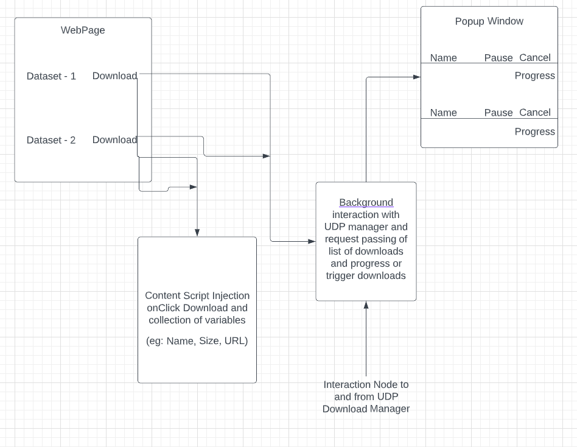

# Data Foundation - Chrome Plugin

This entails the component of making a Browser Plugin for Data Foundation Project.

The Plugin is made for Chrome using manifest version 2.

## Sections
- [Requirements](#requirements)
- [Flowchart](#flowchart)

---

## Requirements
The following are the neccessary requirements and the functionalities of the plugin.

> Functional Requirements

 
 

1. A plugin needs to be developed which allows the user to download large files from the internet via its own Download Manager working on UDP Protocol.

2. It needs to support multiple downloads at one time.

3. It should also have the functionalities to pause/resume and cancel ongoing downloads.

4. A popup window for the plugin which displays the Interface of the manager allowing the user to perform the fore-mentioned functions and displays the list of Downloads.

5. A progress bar displaying the download percentage in real-time.

---

 

## Flowchart

---

